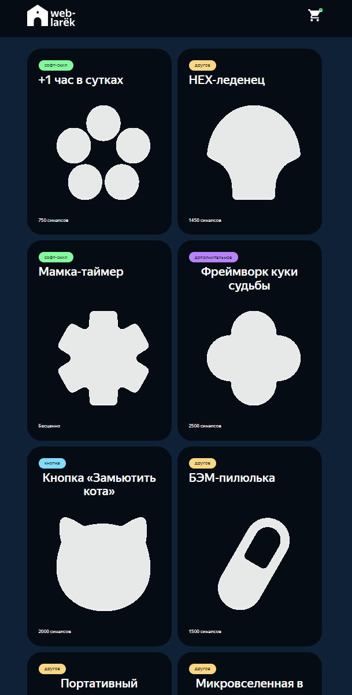

# Проектная работа "Веб-ларек"

Стек: HTML, SCSS, TS, Webpack

Структура проекта:

- src/ — исходные файлы проекта
- src/components/ — папка с TS компонентами
- src/components/base/ — папка с базовым кодом

Важные файлы:

- src/pages/index.html — HTML-файл главной страницы
- src/types/index.ts — файл с типами
- src/index.ts — точка входа приложения
- src/scss/styles.scss — корневой файл стилей
- src/utils/constants.ts — файл с константами
- src/utils/utils.ts — файл с утилитами
- src/components/larek-api.ts — файл с api

## Установка и запуск

Для установки и запуска проекта необходимо выполнить команды

```
npm install
npm run start
```

или

```
yarn
yarn start
```

## Сборка

```
npm run build
```

или

```
yarn build
```

## Скриншоты



## Архитектура

## Паттерн проектирования MVP

Для реализации был выбран паттерн проектирования. Как работает MVP:

- Вид строит интерфейс и добавляет в него данные из модели.
- Пользователь видит информацию и взаимодействует с интерфейсом.
- Вид перехватывает события и передаёт (делегирует) их представителю.
- Представитель обрабатывает данные (не всегда) и передаёт их модели.
- Модель выполняет какие-то операции и обновляется (меняет те или иные свойства).
- Представитель получает обновлённую модель и передаёт её виду.
- Вид строит интерфейс с новыми данными.

## All elements page

ДАННЫЕ:
-Название Товара
-Описание Товара
-Цена товара
-Категория товара
-Изображение Товара
-Способ оплаты
-Адрес доставки
-Почта
-Телефон

ОБЪЕКТЫ
-Товар
-данные покупателя

КОЛЛЕКЦИИ
-КаТалог Товаров

ДЕЙСТВИЯ
-Выбор способа оплаты и адреса
-Указание почты и телефона
-Очистка данных
-запоолнить каталог
-получить каталог
-Добавлять в корзину
-Удалять из корзины
-Очищать корзину
-Получить список

## Типы

Вcе типы описаны в файле ./src/types/index.ts

# Классы

# Presenter

Presenter - Presenter координирует работу и является связующим звеном. Когда в Model чтото меняется он обращается к View чтобы отобразить это, и должен обращаться к Model когда что-то происходит в View

# модель данных Model

Содержит глобальные базовые модели данных с набором следующих методов:

- initialOrder(){} инициализация по новому заказу
- deleteOrder(){} очистка полей заказа
- deleteBasket(){} очистка корзины
- addBasket(){} добавление в корзину
- refresh(){} очищает очередь
- addItem(){} передача ID товара
- getFullPrice(){} получение финальной цены все заказа

# View

Содержит компоненты для работы и отображения страницы

## Класс Template

Абстраткный класс темплейт имплементирует общую логику для шаблонных элементов и от него наследуются конкретные шаблонные элементы card template:
содержит свойство template : HTMLTemplateElement;
- Содержит constructor(id: string) получает id  на вход создает теплейт по поиску элемента по id 
- Содердит метод render(props:P) обрабатывает пропс
- содержит защищенный абстрактный метод \_render(element)

## Класс EventEmitter

Базовый класс, центральный брокер событий. Позволяет компонентам подписываться на события и реагировать на них

- Содержит constructor
- Имплементирует events
- on / off позволяет подписаться и отписаться от события а также его вызвать

## Класс Api

Базовый класс - клиент для взаимодействия с внешними API и сервером. Содержит методы:
// метод для работы с запросами и овтетами конструткор обрабатыват запрос и возвращает данные

- `class Api {
  readonly baseUrl: string;
  protected options: RequestInit;
  constructor(baseUrl: string, options: RequestInit = {});
  protected async handleResponse(response: Response): Promise<Partial<object>>;
  async get(uri: string);
  async post(uri: string, data: object);
}`

## Класс LarekApi

// конструтор создание apiClient на основе имеющегося API_URL содержит асинхронные методы дл получение всех элементов или конкртеного по его ID

- содержит apiClient: Api;
- содерджит constructor()
- содержит async getProducts()
- содержит async getProduct(id:string)

## Класс ProductCard

Класс для создания карточки товара
// класс ProductCard наследует Template. его свойства равны информации о товаре каждого элемента , заголовок, изображение, цена, категория, также формирует каталог карточек

- const title = card.querySelector('.card\_\_title');
- const image = card.querySelector('.card\_\_image') as HTMLImageElement;
- const cardPrice = card.querySelector('.card\_\_price');
- const cardCategory = card.querySelector('.card\_\_category');
- class ProductCard extends Template<Product>
- \_render(card: HTMLElement, product: Product)

## Класс Form<T>

// методы данного класса описывают ошибки валидации форм, а также информацию об успешной их отправке
Класс для управления формами
class Form<T>{
constructor(container,events){ }
errorValue(){}
validValue(){}
}

## Класс Order

Класс предназначен для выбора способа оплаты и ввода адреса доставки
// объект заказа клиента

- type Order={// Массив ID купленных товаров
  items: string[];
  // Способ оплаты
  payment: string;
  // Сумма заказа
  total: number;
  // Адрес доставки
  address: string;
  // Электронная почта
  email: string;
  // Телефон
  phone: string;}
  - class order extends Form{
    constructor()
    }

## Класс Contacts

Класс предназначен для управления формой контактных данных пользователя
// констуктор принимает обратботчик и наследуемый элемент наследуется от Form поля email и phone

- type contacts= {
  phone: string;
  email: string;
  }
- constructor(container: HTMLFormElement, events: Events)

## Класс Basket

// содежит цену товара или всех товаров а также массив элементов
Класс управляет отображением корзины

- constructor()
- getFullPrice(price: number)
- setList(items: HTMLElement[])
- refresh

## Класс Model

- // Принимает данные для хранения, эвент эмиттер
  constructor(data,events)

- // Вызывает эвент
  emitChanges(event) {}

## Класс Success

// при успешном оформлении заказы выводит окно с результатыми проведенной операции
Класс отображения успешного завершения процесса оплаты.

- type succsess= {
  description:string
  }
- class succsess{
  constructor(){}
  ...
  вывод результата оплаты
  }
